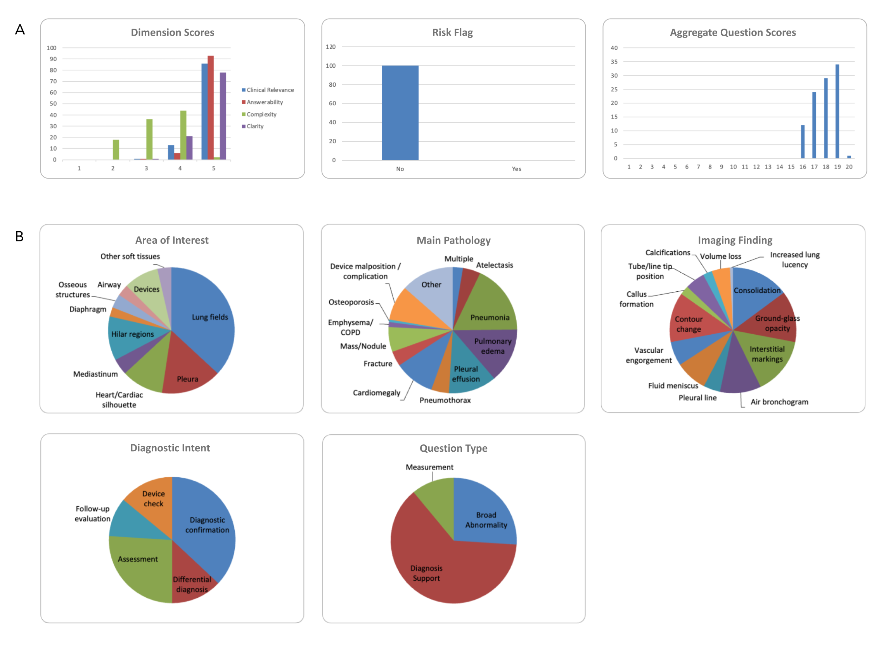

# Supplemental Materials

This page hosts the supplemental materials for "The Intention-Execution Disconnect in Medical AI: The ReXecution Framework for Evaluating Real-World Clinical Performance" by Oishi Banerjee*, Lucas Bijnens*, Subathra Adithan and Pranav Rajpurkar.
This paper was published at the 2026 Pacific Symposium of Biocomputing.

---

## Supplementary Figure 1

---

## Supplementary Table 2



---

## Supplementary Table 3


